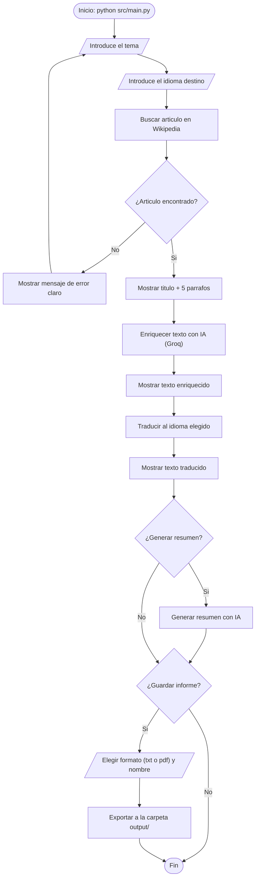
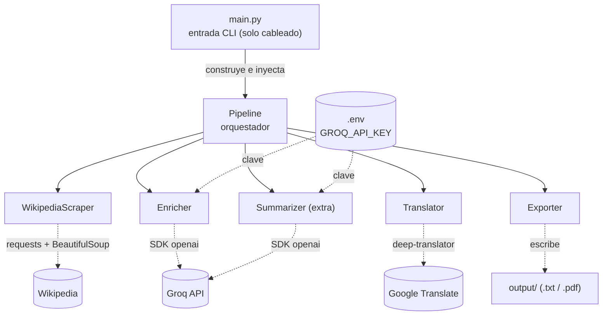
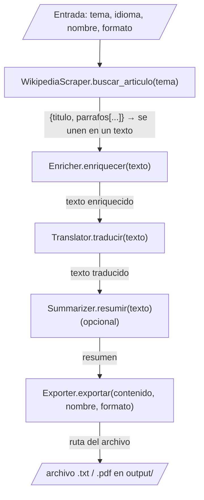

# 📘 Content Enrichment — Wiki Técnica

> Herramienta de línea de comandos (CLI) que, dado un tema, lo **busca en Wikipedia**, lo **enriquece con IA** (Groq, vía el SDK oficial de OpenAI), lo **traduce** al idioma elegido (`deep-translator`) y lo **exporta** como `.txt` o `.pdf`.

> ℹ️ **Estado actual:** estructura (scaffold) completa. Las clases y sus contratos están definidos; la lógica interna de cada método está pendiente de implementar (`raise NotImplementedError`). Esta wiki describe el **diseño acordado** que guía la implementación.

---

## 1. Visión general

El proyecto resuelve un flujo de 4 pasos encadenados, pensado como una **tubería (pipeline)**: la información entra cruda por un extremo y sale procesada por el otro.

```
Tema  ──>  [1. Scraping]  ──>  [2. Enriquecer IA]  ──>  [3. Traducir]  ──>  [4. Exportar]  ──>  archivo.txt / .pdf
Wikipedia      texto crudo        texto mejorado          texto traducido         informe final
                                       │
                                       └──> [Extra: Resumir] (opcional)
```

**Idea clave de diseño:** cada etapa recibe datos y devuelve datos. Manteniendo esa regla, cada parte se construye y se prueba **por separado**.

### Flujo del usuario (flowchart)

Recorrido de la usuaria al ejecutar la app desde la terminal:



> Las llamadas de red (Wikipedia, Groq, traducción) van envueltas en `try/except`: ante un fallo (sin conexión, clave inválida, límite de uso), la app muestra un mensaje claro en vez de romperse.

---

## 2. Arquitectura

Diseño **orientado a objetos** con **una clase por etapa** y **responsabilidad única** (SRP): cada clase hace una sola cosa y no conoce a las demás.

| Principio | Cómo se aplica aquí |
|-----------|---------------------|
| **Responsabilidad única (SRP)** | `WikipediaScraper` no sabe nada de PDFs; `Exporter` no sabe nada de Wikipedia. |
| **Orquestación central** | La clase `Pipeline` es la única que conoce el orden de las etapas y las conecta. |
| **Inyección de dependencias** | `Pipeline`, `Enricher` y `Summarizer` reciben sus colaboradores ya construidos (p. ej. el cliente de OpenAI). Esto permite **mockearlos en los tests**. |
| **`main.py` sin lógica** | Solo lee la entrada del usuario, construye las clases (cableado) y delega en `Pipeline`. |



> `logger_config` es transversal: cada etapa registra inicio/fin/errores en `logs/app.log`. `main.py` no contiene lógica de negocio; solo construye las clases y delega en `Pipeline`.

---

## 3. Stack tecnológico

| Herramienta | Para qué se usa |
|-------------|-----------------|
| **Python 3.10+** | Lenguaje base. |
| **requests + beautifulsoup4** | Descargar y parsear el HTML de Wikipedia. |
| **openai** (SDK v1.0+) apuntado a **Groq** | Enriquecer y resumir texto. Modelo `llama-3.3-70b-versatile`. Se usa el SDK oficial de OpenAI con `base_url` de Groq. |
| **deep-translator** | Traducir (backend de Google, sin clave de API). |
| **reportlab** | Generar el PDF con *Flowables*. |
| **python-dotenv** | Leer secretos desde `.env`. |
| **logging** (estándar) | Registrar el proceso en `logs/app.log`. |
| **pytest + pytest-cov + pytest-bdd** | Tests unitarios, cobertura y escenarios Gherkin. |

> ⚠️ La traducción usa **`deep-translator`**, NO la IA. Enriquecimiento y resúmenes usan **Groq**; la traducción es un paso aparte.

> 🔄 **Decisión técnica (desviación del briefing):** el briefing pide "API de OpenAI", pero OpenAI es de pago. Usamos **Groq** (gratuito), que es **compatible con el SDK de OpenAI**: se mantiene el mismo SDK y solo se cambia `base_url` a `https://api.groq.com/openai/v1` con una `GROQ_API_KEY` gratuita. Misma lógica que usar `deep-translator` en vez de "DeepTranslate".

---

## 4. Estructura de carpetas

```
Content_Enrichment/
├── src/                     Código fuente (paquete Python)
│   ├── __init__.py
│   ├── main.py              Punto de entrada CLI (solo cableado)
│   ├── pipeline.py          Orquestador del flujo completo
│   ├── scraper.py           Etapa 1: WikipediaScraper
│   ├── enricher.py          Etapa 2: Enricher (Groq vía SDK de OpenAI)
│   ├── translator.py        Etapa 3: Translator (deep-translator)
│   ├── exporter.py          Etapa 4: Exporter (.txt / .pdf)
│   ├── summarizer.py        Extra: Summarizer (Groq vía SDK de OpenAI)
│   └── logger_config.py     Configuración central de logs
├── tests/                   Suite de pruebas (paquete Python)
│   ├── __init__.py
│   ├── conftest.py          Fixtures compartidas (datos de ejemplo)
│   ├── test_scraper.py      Tests unitarios (uno por módulo)
│   ├── test_enricher.py
│   ├── test_translator.py
│   ├── test_summarizer.py
│   ├── test_exporter.py
│   ├── test_pipeline.py     Test de integración del pipeline completo
│   └── features/            Escenarios BDD en Gherkin (pytest-bdd)
│       ├── enriquecimiento.feature
│       └── test_enriquecimiento_steps.py
├── output/                  Archivos generados (ignorado por git)
├── logs/                    Logs de ejecución (ignorado por git)
├── .env                     Claves secretas (NUNCA se sube a git)
├── .env.example             Plantilla de claves (sí se sube)
├── .gitignore
├── requirements.txt         Dependencias del proyecto
├── setup.cfg                Configuración de pytest y cobertura
└── README.md
```

> 📦 **`src/` y `tests/` son "paquetes Python"** (llevan `__init__.py`): eso permite importar con `from src.scraper import WikipediaScraper` desde cualquier sitio.
>
> 📝 **Nota:** el plan de trabajo (`PLAN_DE_TRABAJO.md`) y la guía interna de IA (`CLAUDE.md`) existen en local pero están **ignorados por git** (no se suben al repo), por decisión del proyecto.

---

## 5. Las clases en detalle

### 5.1 `WikipediaScraper` — Etapa 1 (scraping)
- **Responsabilidad:** obtener contenido crudo de Wikipedia.
- **Constructor:** `WikipediaScraper(idioma="es")`.
- **Método principal:** `buscar_articulo(tema: str) -> dict`
  - Devuelve `{'titulo': str, 'parrafos': [str, ...]}`.
  - Lanza `ArticuloNoEncontrado` si el tema no existe.
- **Constantes:** `MAX_PARRAFOS = 5` (máximo 5 párrafos), `USER_AGENT` personalizado (obligatorio al scrapear).

### 5.2 `Enricher` — Etapa 2 (enriquecimiento IA)
- **Responsabilidad:** mejorar un texto usando la IA (Groq).
- **Constructor:** `Enricher(client)` — recibe un cliente `openai.OpenAI` ya configurado con el `base_url` de Groq (inyección de dependencias → mockeable en tests).
- **Método principal:** `enriquecer(texto: str) -> str`.
- **Modelo:** `llama-3.3-70b-versatile`. La clave (`GROQ_API_KEY`) se lee de `.env`, nunca se hardcodea.

### 5.3 `Translator` — Etapa 3 (traducción)
- **Responsabilidad:** traducir texto al idioma destino.
- **Constructor:** `Translator(idioma_destino: str)`.
- **Método principal:** `traducir(texto: str) -> str`.
- **Notas:** usa `deep-translator` (Google); **no** usa la IA (Groq) ni necesita clave de API.

### 5.4 `Summarizer` — Extra (resumen)
- **Responsabilidad:** generar un resumen breve del contenido enriquecido.
- **Constructor:** `Summarizer(client)` — cliente `openai.OpenAI` (apuntado a Groq) inyectado.
- **Método principal:** `resumir(texto: str) -> str`.
- **Modelo:** `llama-3.3-70b-versatile`.

### 5.5 `Exporter` — Etapa 4 (exportación)
- **Responsabilidad:** persistir el resultado en disco.
- **Constructor:** `Exporter(carpeta_salida="output")`.
- **Método principal:** `exportar(contenido: dict, nombre: str, formato: str) -> str`
  - Devuelve la ruta del archivo creado.
  - Lanza `FormatoNoSoportado` si el formato no es `'txt'` ni `'pdf'`.
- **Constante:** `FORMATOS = ("txt", "pdf")`.
- **Nota técnica:** el PDF se genera con `reportlab` usando **Flowables** (`SimpleDocTemplate` + `story`), nunca con posicionamiento manual del canvas (evita solapamiento de texto).

### 5.6 `Pipeline` — Orquestador
- **Responsabilidad:** coordinar las etapas; **no** contiene lógica de negocio propia.
- **Constructor:** `Pipeline(scraper, enricher, translator, exporter, summarizer=None)` — todas las etapas se inyectan.
- **Método principal:** `ejecutar(tema, idioma_destino, nombre, formato) -> str`
  - Encadena: scraping → enriquecer → traducir → (resumir) → exportar.
  - Devuelve la ruta del archivo generado.

### 5.7 `logger_config.configurar_logger`
- Función que devuelve un `logging.Logger` que escribe en `logs/app.log` con fecha y nivel (HU-7).

---

## 6. Flujo de datos



> 📌 **Contrato pendiente de cerrar:** la forma exacta del `dict` `contenido` que recibe `Exporter` (qué claves lleva: original / enriquecido / traducido / resumen) se definirá al implementar el `Pipeline`. Documentar aquí cuando se decida.

---

## 7. Configuración (`.env`)

El proyecto lee secretos desde un archivo `.env` local (nunca se sube a git).

```
GROQ_API_KEY=tu_clave_aqui
```

Para empezar: copia `.env.example` a `.env` y rellena el valor real. La clave de Groq es **gratuita**: https://console.groq.com/keys

> 🔐 Regla de seguridad: `.env` **JAMÁS** se sube a GitHub. Si una clave se filtra, revócala de inmediato.

---

## 8. Cómo ejecutar

```bash
# 1. Crear y activar el entorno virtual
python -m venv venv
venv\Scripts\activate          # Windows
# source venv/bin/activate     # Mac/Linux

# 2. Instalar dependencias
pip install -r requirements.txt

# 3. Configurar secretos
copy .env.example .env         # Windows  (cp en Mac/Linux)
#   -> editar .env y poner la GROQ_API_KEY

# 4. Ejecutar la app
python src/main.py
```

---

## 9. Tests y calidad

```bash
pytest                                          # ejecuta toda la suite
pytest --cov=src --cov-report=term-missing      # cobertura
```

| Aspecto | Configuración |
|---------|---------------|
| **Framework** | `pytest` (config en `setup.cfg`). |
| **Cobertura objetivo** | **100%** (`fail_under = 100`, con cobertura de ramas activada). |
| **Mocking** | Toda llamada de red/API (Wikipedia, Groq, traducción) se **mockea**; los tests no usan internet. |
| **BDD** | Escenarios Gherkin en `tests/features/*.feature` ejecutados con `pytest-bdd`. |
| **Lint / formato** | `flake8 src` · `black --check .` |

---

## 10. Manejo de errores

| Situación | Excepción / comportamiento |
|-----------|----------------------------|
| Tema inexistente en Wikipedia | `ArticuloNoEncontrado` |
| Formato de exportación inválido | `FormatoNoSoportado` |
| Errores de API/HTTP (Groq, red) | Capturar siempre; mensaje claro al usuario, sin *fallbacks* silenciosos. |

---

## 11. Mapa de funcionalidades (historias de usuario)

| ID | Funcionalidad | Clase responsable |
|----|---------------|-------------------|
| HU-1 | Introducir tema e idioma por terminal | `main.py` |
| HU-2 | Buscar en Wikipedia (título + 5 párrafos) | `WikipediaScraper` |
| HU-3 | Enriquecer contenido con IA | `Enricher` |
| HU-4 | Traducir al idioma elegido | `Translator` |
| HU-5 | Exportar a `.txt` / `.pdf` con nombre a elección | `Exporter` |
| HU-6 | Resumen del contenido (extra) | `Summarizer` |
| HU-7 | Sistema de logs | `logger_config` |
| HU-8 | Mensajes de error claros | Todas (vía `try/except`) |

---

## 12. Decisiones técnicas a registrar

> A medida que se implemente, anotar aquí las decisiones para no perderlas:
> - Forma final del `dict contenido` que consume `Exporter`.
> - Prompt de sistema usado en `Enricher` y `Summarizer`.
> - Idiomas soportados / códigos aceptados en `Translator`.
> - Estructura del informe en el PDF (orden de secciones, estilos).

---

## 13. Glosario (términos clave)

| Término | Qué significa aquí |
|---------|--------------------|
| **Pipeline (tubería)** | Cadena de etapas donde la salida de una es la entrada de la siguiente. |
| **Clase / método** | Una *clase* agrupa datos y funciones de una "cosa" (ej. `Enricher`); un *método* es una función dentro de la clase (ej. `enriquecer`). |
| **SRP (Responsabilidad Única)** | Cada clase hace **una sola cosa**. Facilita entender, probar y cambiar el código. |
| **Inyección de dependencias** | Pasar los colaboradores ya construidos por el constructor (ej. el cliente de Groq) en vez de crearlos dentro. Permite sustituirlos en los tests. |
| **Mock** | Objeto falso que imita a uno real (API, red) en los tests, para no usar internet ni gastar tokens. |
| **Scaffold (andamiaje)** | Estructura del proyecto creada pero sin la lógica interna todavía (los métodos lanzan `NotImplementedError`). |
| **Excepción** | Error controlado que se "lanza" (`raise`) y se "captura" (`try/except`) para no romper la app (ej. `ArticuloNoEncontrado`). |
| **Flowable (`reportlab`)** | Bloque de contenido (párrafo, tabla…) que `reportlab` coloca y pagina **solo**, evitando que el texto se solape. |
| **Gherkin / BDD** | Forma de escribir pruebas en lenguaje casi natural (*Dado / Cuando / Entonces*) en archivos `.feature`, ejecutadas con `pytest-bdd`. |
| **`.env`** | Archivo local con secretos (claves). Nunca se sube a git. |
| **Cobertura (coverage)** | Porcentaje de líneas/ramas del código que ejecutan los tests. Objetivo: 100%. |
